# EDA 發現 (EDA Findings)

[English](../EDA/EDA_findings.md) | **繁體中文**

本文件描述**資料呈現的現象**，只陳述觀察到的樣態，不推論成因；「為什麼」留待後續假設檢定。

- 資料來源：由 `ETL_scripts/Auto_ETL.bat` 建立的 `DB/olist.duckdb`
- 腳本：`EDA/scipts/01_*.py` – `08_*.py`、`random_forest/scripts/04_*.py` – `07_*.py` 與 `time_matrix/scripts/01_*.py` – `05_*.py`；圖表在 `EDA/charts/`、`random_forest/charts/` 與 `time_matrix/charts/`，統計表在對應的 `outputs/` 資料夾
- 期間：2016-09-04 至 2018-10-17（2016 Q3/Q4 與 2018 Q3/Q4 為不完整季度）

## 名詞定義 (Definitions)

| 名詞 | 定義 |
|---|---|
| 顧客 | `customer_unique_id`（跨訂單的同一人）；`customer_id` 為每筆訂單各自產生 |
| 有效訂單 | `order_status` 不為 `canceled`、`unavailable` |
| 顧客位置 | 顧客最近一筆訂單的州 |
| 店家位置 | `seller_zip_code_prefix` 對應 `geolocation_zip` 的郵遞區號中心點 |
| 出貨 | 同一訂單中同一店家寄出的商品（`order_id` × `seller_id`） |
| 距離 | 店家與顧客郵遞區號中心點之間的大圓距離 |
| 箱形圖 | 箱子 = Q1–Q3，虛線 = 中位數，鬚線 = 1.5 × IQR，不畫離群值 |

## 1. 資料品質 (Data Quality)

### 1.1 各欄位缺失

- 52 個欄位中有 13 個含 NULL，其餘 39 個完整。
- 88.3% 的評論沒有 `review_comment_title`，58.7% 沒有 `review_comment_message`；56,518 則兩者皆無。
- `products` 中同樣的 610 筆（1.9%）在 4 個描述欄位（品類、名稱長度、描述長度、照片數）同時為 NULL；另有 2 筆商品缺尺寸與重量。

### 1.2 訂單時間欄位 × 訂單狀態

- 時間欄位的 NULL 與 `order_status` 對齊：`created` 訂單三個時間全缺；`invoiced` / `processing` / `unavailable` 兩個配送日期全缺；`shipped` 訂單全缺顧客收貨日。
- 96,478 筆 `delivered` 訂單中，14 筆缺 `order_approved_at`、2 筆缺 `order_delivered_carrier_date`、8 筆缺 `order_delivered_customer_date`。

### 1.3 資料表之間的缺口

- 775 筆訂單（0.78%）沒有商品明細、768 筆（0.77%）沒有評論、1 筆沒有付款紀錄。
- 13 筆商品屬於翻譯表中沒有的 2 個品類（`pc_gamer`、`portateis_cozinha_e_preparadores_de_alimentos`）。
- 279 位顧客、7 家店家的郵遞區號在地理資料中找不到。

## 2. 顧客 (Customers)

### 2.1 地區

- 共 96,096 位顧客。SP、RJ、MG 三州合計 66.5%，SP 單州 41.9%。
- 依區域：東南部 68.6%、南部 14.2%、東北部 9.5%、中西部 5.8%、北部 1.9%。

### 2.2 各季消費

- 完整季度中，總消費額從 R$ 846K（2017 Q1）增加到 R$ 3.3M（2018 Q2，最高）。
- 每季顧客數從 5,014（2017 Q1）增加到 20,556（2018 Q1），每位顧客的季消費額維持在 R$ 157–169 之間。
- 各季的消費層級分布穩定：自 2016 Q4 起，50–100 與 100–200 BRL 一直是最大的兩個層級，合計占 59–64% 的顧客。

### 2.3 付款

- 主要付款方式（每位顧客金額最高者）：信用卡 75.5%、boleto 19.9%、voucher 3.1%、debit card 1.5%。
- 73,270 位信用卡顧客中，33.0% 一律一次付清；67.0% 用過 2 期以上分期，15.6% 用過 7–10 期。

### 2.4 評分

- 分布：5 ★ 58.2%、4 ★ 19.4%、3 ★ 8.3%、2 ★ 3.2%、1 ★ 10.9%。
- 呈 U 形：1 ★ 的數量多於 2 ★ 與 3 ★。

### 2.5 品類

- 前 15 大品類占總消費的 76.4%。
- 訂單數排名與消費額排名不同：`bed_bath_table` 訂單數最多（9,399）但消費額排第 3；`watches_gifts` 訂單數排第 7，消費額排第 2（R$ 1.3M）。

### 2.6 各區域消費

- 消費 ≥ 200 BRL 的顧客比例：北部 34.7%、東南部 19.7%。
- 每位顧客平均消費：北部 R$ 230、東北部 R$ 207、中西部 R$ 183、南部 R$ 168、東南部 R$ 156。
- 與東南部相比，北部顧客的平均商品金額高 38%，平均運費為 2.1 倍；運費占消費的比例北部 19%、東南部 13%。

## 3. 店家 (Sellers)

### 3.1 店家層級的回購率

- 以顧客來看，97.0% 的購買顧客只有一筆有效訂單（若把同一天的訂單合併為一次購買，則為 97.8%，見 5.1）。
- 以店家 × 品類來看（該品類客戶 ≥ 30 位的店家，共 635 組）：63% 的店家完全沒有回頭客；整體 Q1 = 0%、中位數 = 0%、Q3 = 1.1%。
- 只有 3 個品類的中位數高於 0%：`construction_tools_construction` 1.35%、`bed_bath_table` 0.41%、`fashion_bags_accessories` 0.31%；其中 `fashion_bags_accessories` 分布最寬（Q3 4.33%）。

### 3.2 店家與顧客的位置

- 3,095 家店家中有 3,088 家（99.8%）可定位。
- SP 州有 59.7% 的店家、41.9% 的顧客。
- 店家占比高於顧客占比的區域：東南部（73.9% vs 68.6%）、南部（21.6% vs 14.2%）；低於顧客占比的區域：東北部（1.8% vs 9.5%）、中西部（2.6% vs 5.8%）、北部（0.16% vs 1.9%）。
- 每家店家對應的顧客數：北部 359、東北部 163、中西部 71、東南部 29、南部 20。

### 3.3 出貨流向

- 83.5% 的出貨從東南部寄出；東南部寄往東南部即占 58.4%。
- 35.9% 的出貨為同州寄送。
- 各品類的目的地分布不同：`telephony` 有 15.4% 寄往東北部（全品類為 9.4%）；`bed_bath_table` 有 75.8% 寄往東南部（全品類為 68.6%）。
- 前 15 大品類的寄送距離中位數介於 379 km（`housewares`、`toys`）到 506 km（`computers_accessories`）。

## 4. 訂單金額 (Order Value)

### 4.1 距離與訂單金額

- 運費隨距離增加：中位數從 R$ 10（< 100 km）到 R$ 30（≥ 2,000 km）；Spearman ρ = 0.58。
- 每筆出貨的商品金額與距離僅弱相關（ρ = 0.11；同品類內 ρ 的中位數也是 0.11）。中位數在 100 km 以內為 R$ 67，超過 100 km 為 R$ 87–100。

### 4.2 各品類的平均 vs 中位數

- 前 20 大品類的每筆訂單商品金額，平均值全部高於中位數（1.25–2.82 倍）；全部訂單的中位數 R$ 87、平均 R$ 137。
- 差距最大：`electronics`（中位數 R$ 22、平均 R$ 62，2.82 倍）、`telephony`（R$ 30 vs R$ 77，2.57 倍）。
- 中位數最高為 `office_furniture` R$ 160，最低為 `electronics` R$ 22。

### 4.3 各區域的單次消費額

- 每筆訂單付款金額中位數：北部 R$ 142、東北部 R$ 130、中西部 R$ 114、南部 R$ 108、東南部 R$ 100。
- 各區每位顧客的訂單數相近（1.027–1.035），因此各區每位顧客消費額的排名與單筆訂單金額的排名一致。

## 5. 顧客活躍度 (Customer Activity)

腳本：`random_forest/scripts/04_*.py` – `07_*.py`；圖表在 `random_forest/charts/`。

### 5.1 購買次數與活躍切分點
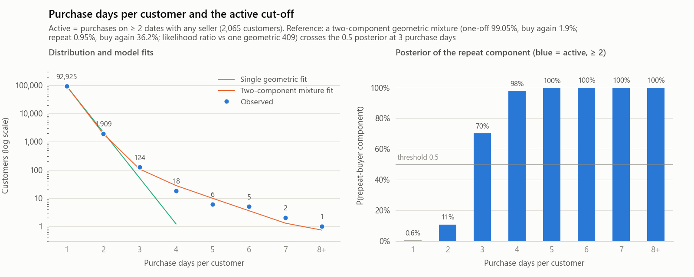

- 購買次數 = 每位顧客的不同購買日期數（不限店家）。2,888 位多訂單顧客中，823 位的所有訂單都在同一天；相鄰訂單間隔有四分之一不到 7 分鐘。
- 活躍 = 在 ≥ 2 個日期購買：2,065 位（2.17%）；一次型：92,925 位。
- 兩成分幾何混合模型的擬合遠優於單一幾何分布（概似比 409）：99.05% 的顧客再次購買機率為 1.9%，0.95% 為 36.2%。

### 5.2 活躍 vs 一次型顧客
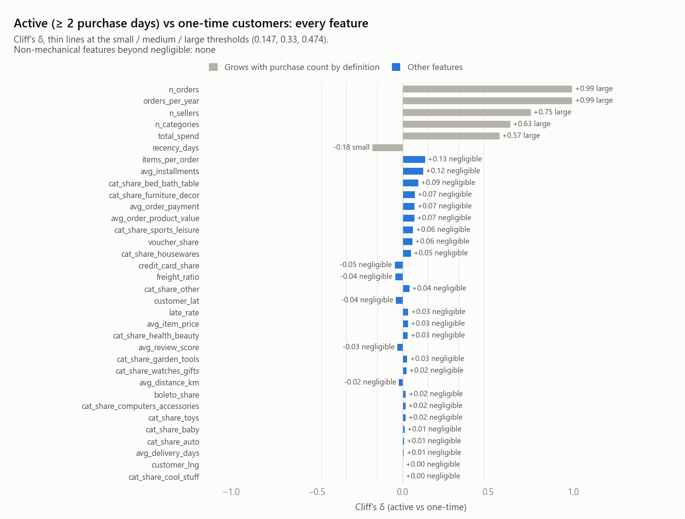
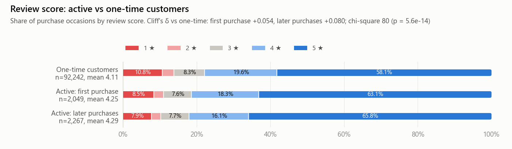
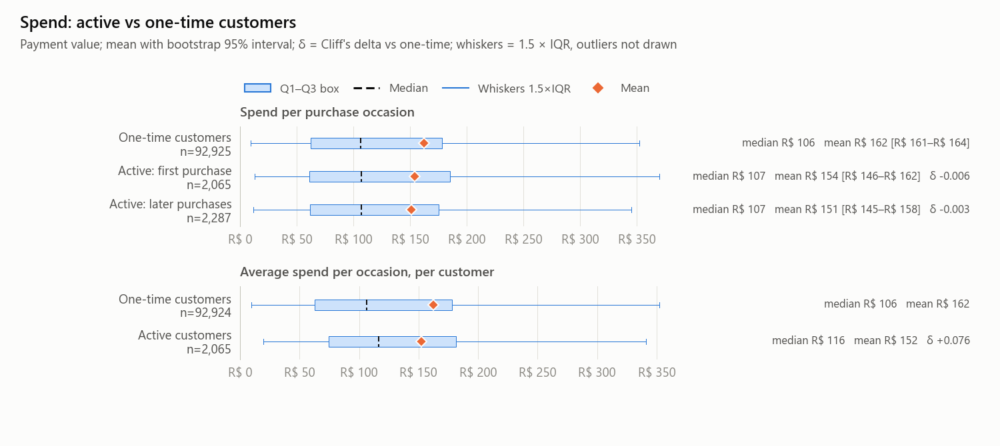

- 大差異只出現在隨購買次數增加的特徵（訂單數、店家數、品類數、總消費）；其餘特徵差異皆可忽略（|Cliff's δ| ≤ 0.13）：訂單金額、商品單價、運費比例、距離、配送天數、品類組成、付款方式、評分。
- 5 星占比：一次型 58.1%、活躍顧客首次購買 63.0%、後續購買 65.7%（Cliff's δ 0.05–0.08）。
- 每次購買消費額中位數：一次型 R$ 106，活躍顧客首次與後續購買皆為 R$ 107。
- 以隨機森林對活躍顧客分群，4 項品質指標全部低於同樣人數的隨機一次型顧客樣本。

### 5.3 地理分布
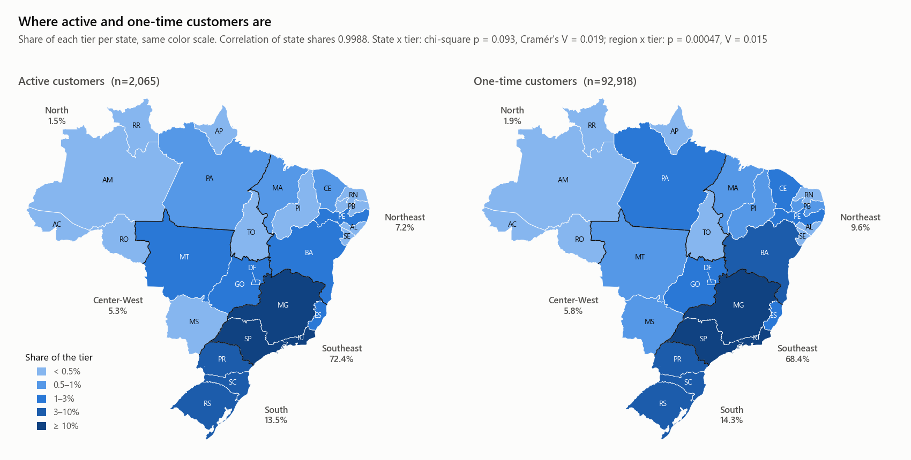

- 活躍與一次型顧客的州占比相關係數 0.9988；州 × 層級卡方 p = 0.093，Cramér's V = 0.019。
- 各區活躍率：東南部 2.30%、南部 2.06%、中西部 1.98%、北部 1.80%、東北部 1.63%（區域 × 層級 p = 0.0005，Cramér's V = 0.015）。

## 6. 購買的時間序列 (Purchases Over Time)

### 6.1 每週購買量
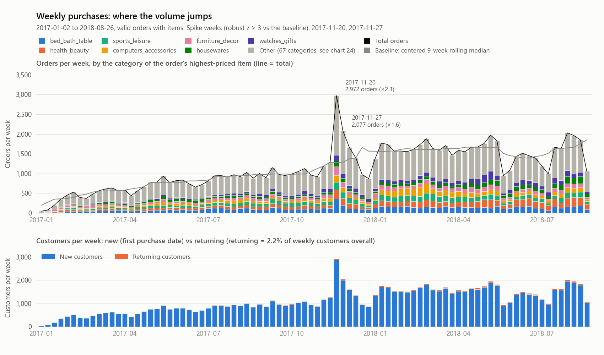
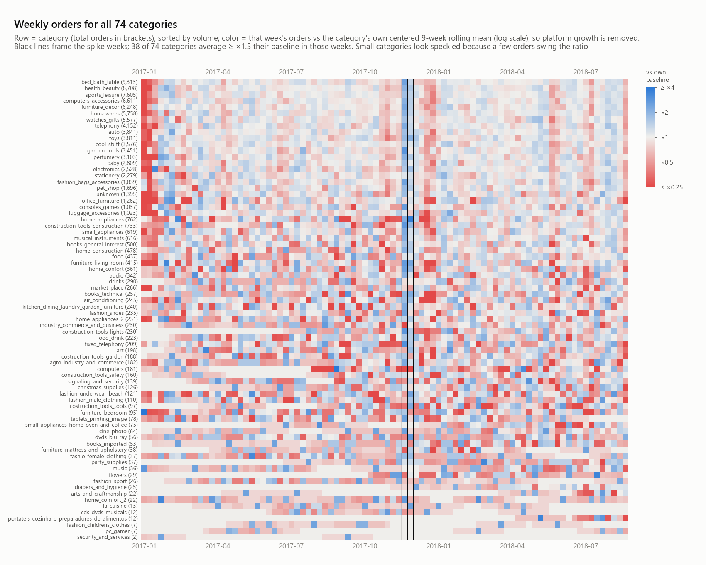

- 每週訂單數平均：2017 年 853 筆，2018 年 1–8 月 1,571 筆。
- 兩個高峰週（相對以該週為中心的 9 週滾動中位數，穩健 z ≥ 3）：2017-11-20 那週 2,972 筆（×2.3）、2017-11-27 那週 2,077 筆（×1.6）；次高的週 z = 2.6。
- 2017-11-20 那週的 2,931 位顧客中有 2,881 位是新客；整段期間回頭客占每週顧客的 2.2%。
- 74 個品類中有 38 個在高峰週達到自身滾動基準的 1.5 倍以上。

### 6.2 價與量
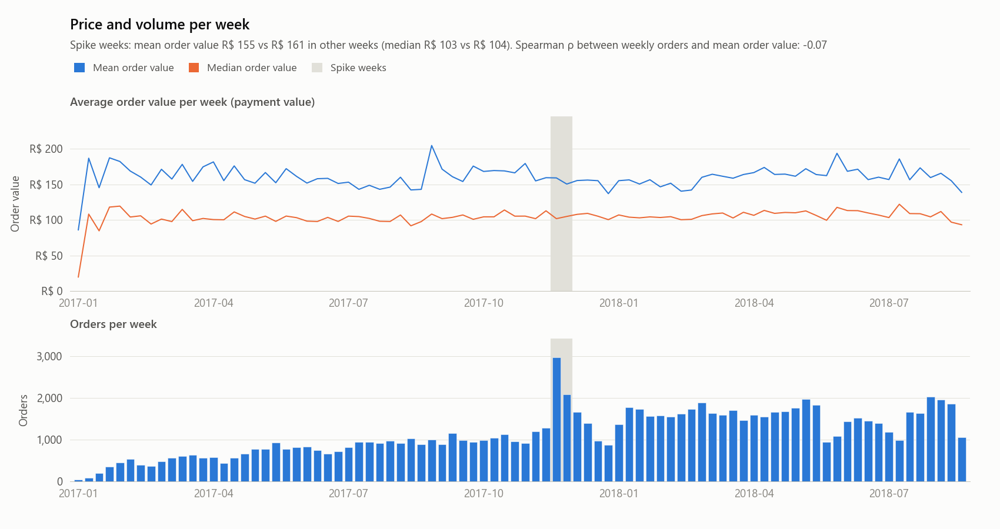

- 平均訂單金額：高峰週 R$ 155、其他週 R$ 161；中位數 R$ 103 vs R$ 104。
- 每週訂單數與每週平均訂單金額的 Spearman ρ：−0.07。

### 6.3 高峰週的首購顧客
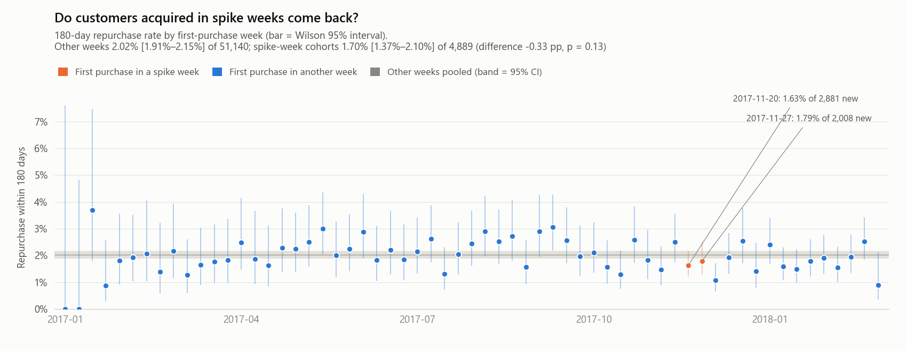
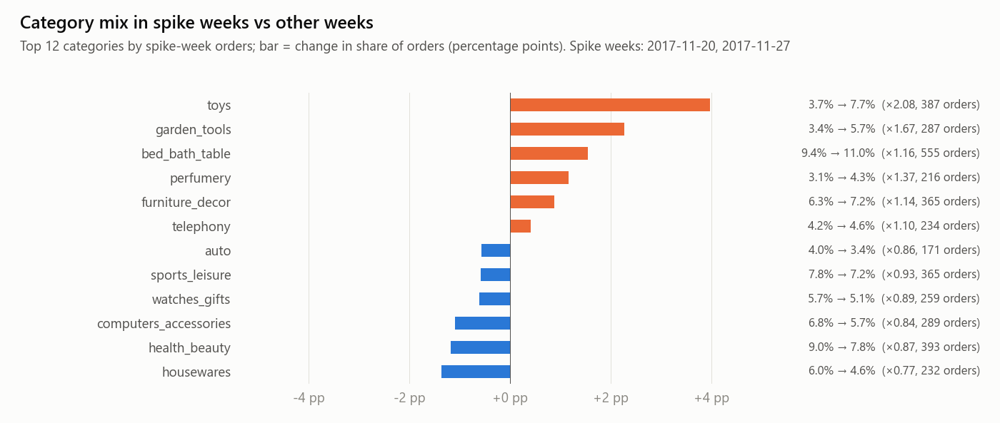

- 180 天內回購率：首購在高峰週 1.70% [1.37–2.10]，其他週 2.02% [1.91–2.15]（差 −0.33 個百分點，p = 0.13）。
- 高峰週占比上升最多的品類：`toys` 3.7% → 7.7%、`garden_tools` 3.4% → 5.7%、`perfumery` 3.1% → 4.3%。

## 7. 回購者 (Repeat Buyers)

### 7.1 購買次數漏斗
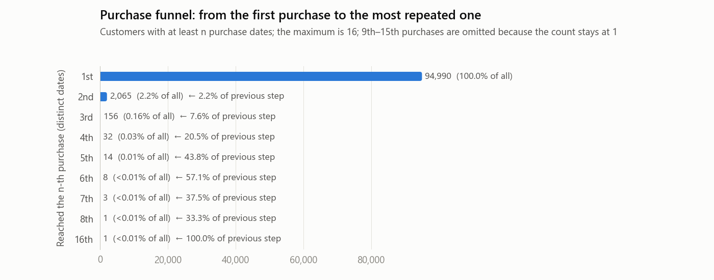

- 達到第 n 次購買的顧客數：94,990 → 2,065 → 156 → 32 → 14 → 8 → 3 → 1（最多 16 個購買日期）。
- 各步轉換率：第 1 → 2 次 2.2%，之後依序為 7.6%、20.5%、43.8%、57.1%。

### 7.2 各次購買的消費額與品類
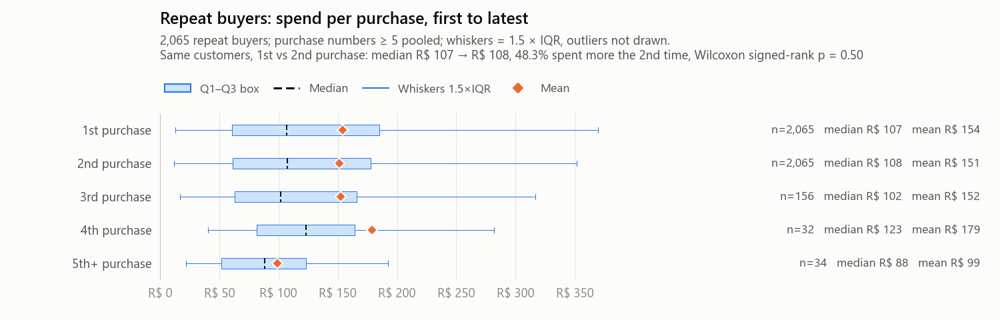
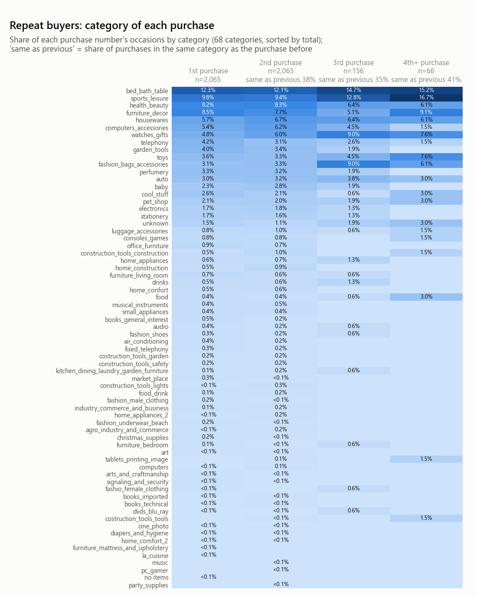

- 同一批 2,065 位顧客第 1 次 vs 第 2 次購買：中位數 R$ 107 → R$ 108，48.3% 第二次花得較多，Wilcoxon 配對檢定 p = 0.50。
- 第 1、2 次購買的品類組成相近（例如 `bed_bath_table` 12.3% → 12.1%、`sports_leisure` 9.8% → 9.4%）。
- 回購中有 35–41% 與前一次購買同品類。

## 8. 運費、商品價值、距離與重量 (Freight, Value, Distance and Weight)

### 8.1 依商品價值看運費占比
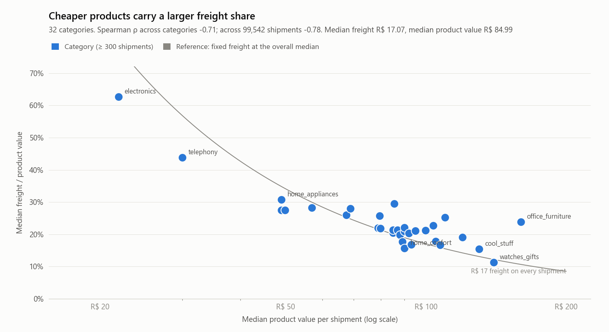

- 每筆出貨運費中位數 R$ 17.07，商品金額中位數 R$ 84.99。
- 商品金額與運費占比的 Spearman ρ：32 個品類之間 −0.71，99,542 筆出貨之間 −0.78。
- 運費占比中位數：`electronics` 63%（商品中位數 R$ 22）、`telephony` 44%（R$ 30）、`watches_gifts` 11%（R$ 140）。

### 8.2 依距離與重量看運費
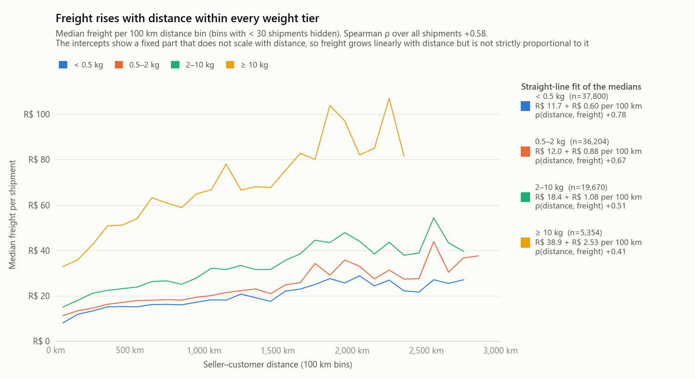

- 每個重量層的運費都隨距離上升。分箱中位數的直線擬合：< 0.5 kg 為 R$ 11.7 + 每 100 km R$ 0.60；0.5–2 kg 為 R$ 12.0 + R$ 0.88；2–10 kg 為 R$ 18.4 + R$ 1.08；≥ 10 kg 為 R$ 38.9 + R$ 2.53。
- 距離與運費的 Spearman ρ：整體 0.58，由最輕到最重的重量層依序為 0.78 到 0.41。

### 8.3 各品類的寄送距離分布
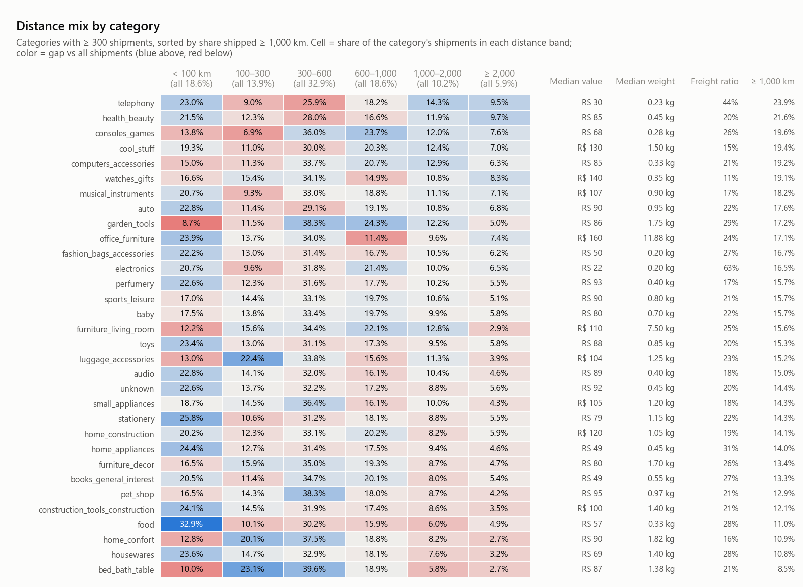
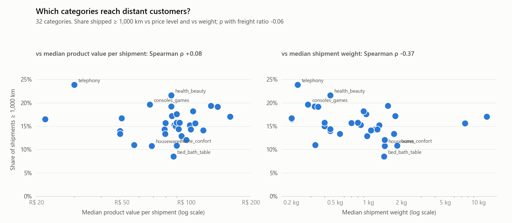

- 寄送 ≥ 1,000 km 的出貨占比，從 8.5%（`bed_bath_table`）到 23.9%（`telephony`）。
- 各品類之間，遠距占比與重量中位數的 ρ = −0.37，與商品金額中位數 +0.08，與運費占比 −0.06。

## 9. 星期 × 小時 (Weekday × Hour)

腳本：`time_matrix/scripts/01_*.py` – `05_*.py`；圖表在 `time_matrix/charts/`。共 98,206 筆有效訂單、92 週；小時以資料中的購買時間戳記為準。

### 9.1 訂單量、訂單金額與分期
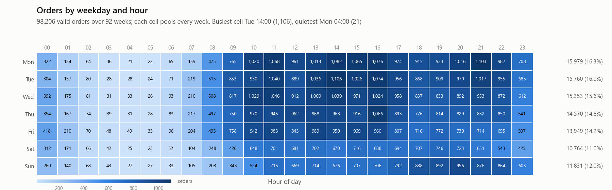
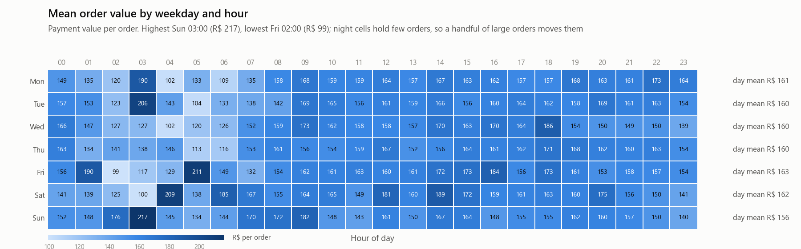
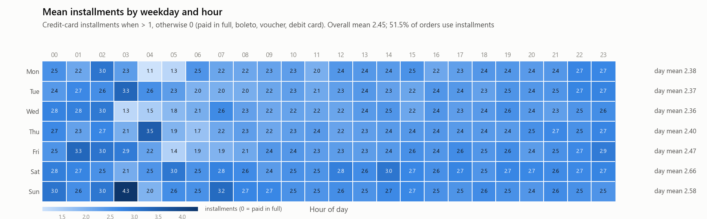

- 各星期的訂單占比：週一 16.3%、週二 16.0%、週三 15.6%、週四 14.8%、週五 14.2%、週日 12.0%、週六 11.0%。
- 平日 10:00–22:00 的每個時段有 695–1,106 筆訂單；最多是週二 14:00（1,106 筆），最少是週一 04:00（21 筆）。週日 18:00–22:00 每小時 864–956 筆。
- 各星期的平均訂單金額：R$ 156（週日）到 R$ 163（週五）。
- 平均分期期數（一次付清記為 0）：平日 2.36–2.47，週六 2.66，週日 2.58；51.5% 的訂單有分期。

### 9.2 時段群數
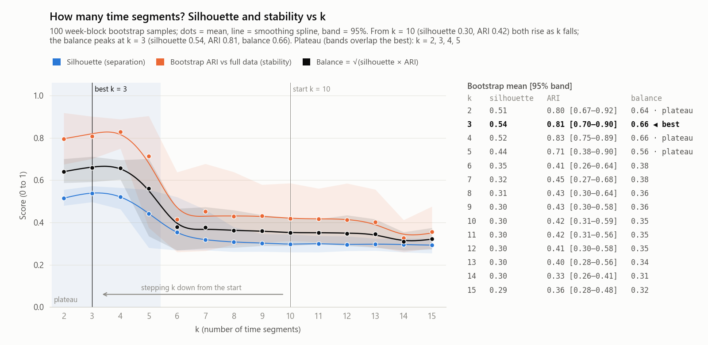

- 以 168 個時段（log 每週訂單數、平均訂單金額、平均分期）做 KMeans，並用 100 次整週重抽（week-block bootstrap）評分。
- k = 10 時：輪廓係數 0.30、bootstrap ARI 0.42。平衡分數（√(輪廓係數 × ARI)）從 k = 15 到 k = 6 都停在 0.31–0.38。
- 從 k = 5 往下兩項分數同時上升；平衡分數在 k = 3 最高（輪廓係數 0.54、ARI 0.81、平衡 0.66）。k = 2 到 5 的 95% 區間與最佳值重疊。

### 9.3 三個時段群
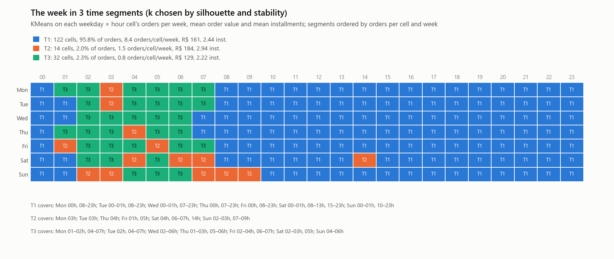
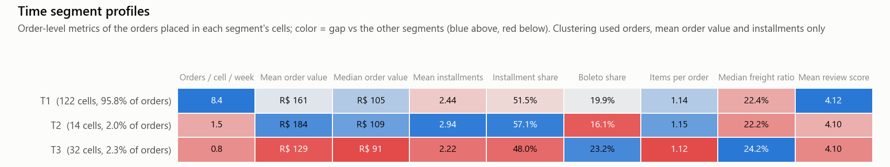

| 群 | 時段數 | 在一週中的位置 | 占訂單 | 每時段每週訂單 | 平均訂單金額 | 平均分期 |
|---|---|---|---|---|---|---|
| T1 | 122 | 每天約 08:00–00:00（週三、週四從 07:00，週日從 10:00） | 95.8% | 8.4 | R$ 161 | 2.44 |
| T2 | 14 | 零散的深夜與清晨時段，加上週六 14:00 | 2.0% | 1.5 | R$ 184 | 2.94 |
| T3 | 32 | 主要為 01:00–07:00 | 2.3% | 0.8 | R$ 129 | 2.22 |

- boleto 占比、每單件數、運費占比與評分在各群之間差異很小（例如評分 4.10–4.12）。

### 9.4 關聯與穩定度
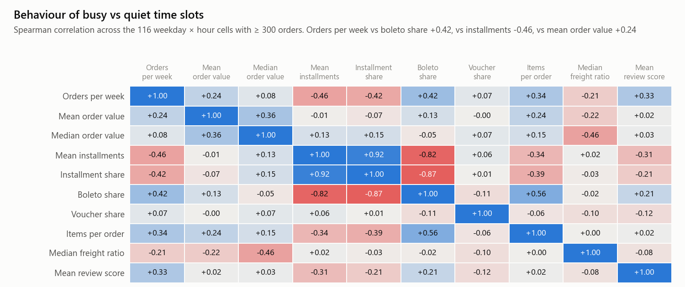
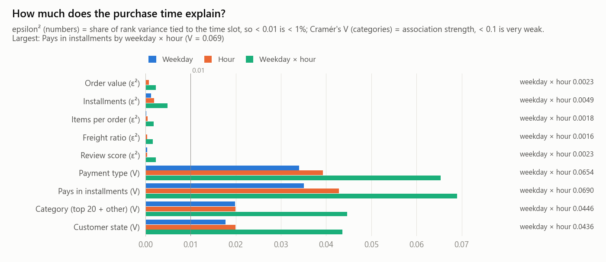
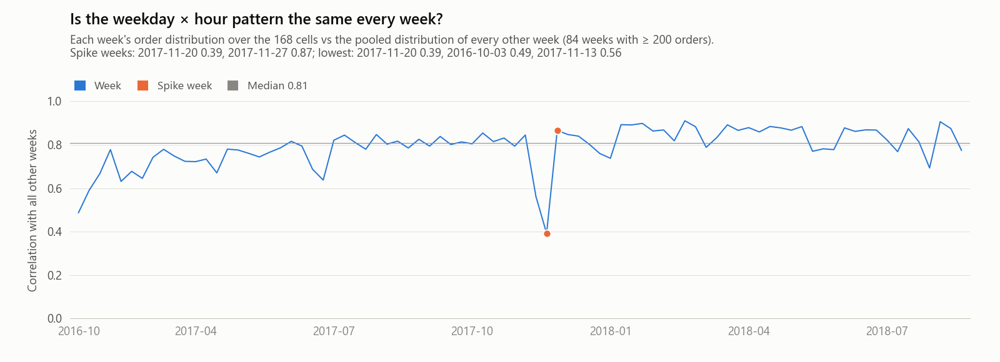
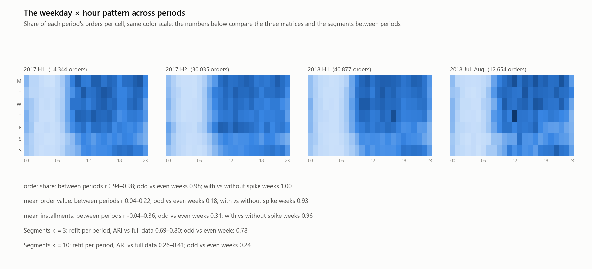

- 以時段為單位，越忙的時段 boleto 占比越高（ρ = +0.42）、分期越少（ρ = −0.46）。
- 以單筆訂單來看，時段能解釋的差異很小：訂單金額 epsilon² 0.0023、分期 0.0049；付款方式 Cramér's V 0.065、是否分期 0.069。
- 訂單占比的時間樣態會重現：四個時期之間 r = 0.94–0.98，奇偶週之間 0.98，有無高峰週之間 1.00。每週與其餘各週的相關中位數 0.81；黑色星期五那週為 0.39。
- 訂單金額與分期的時間樣態在時期之間不重現（r = 0.04–0.22 與 −0.04–0.36）。
- 各時期分別重新分群，3 群會重現（ARI 0.69–0.80），10 群不會（0.26–0.41）。

### 9.5 T1 內的黃金時段
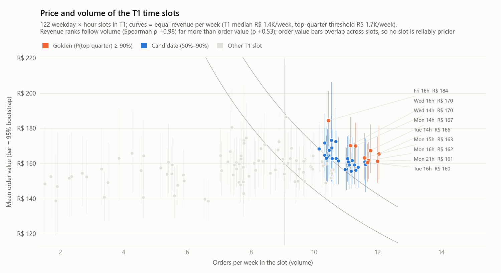
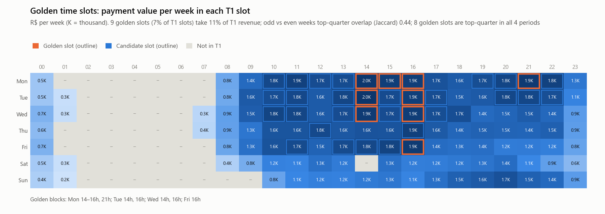

- 黃金時段 = 在 1,000 次整週重抽中，以每週營收計進入 T1 前 25% 的比例 ≥ 90%；候選時段 = 50–90%。
- 9 個黃金時段：**週一 14–16 點與 21 點、週二 14 點與 16 點、週三 14 點與 16 點、週五 16 點**。每個時段每週 R$ 1.87K–1.99K；9 個中有 8 個在四個時期都進入前 25%。合計占 T1 時段數 7%、T1 營收 11%。
- 26 個候選時段（每週 R$ 1.69K–1.86K）：週一 10–13、19–20、22 點；週二 10–11、13、15、17、20–22 點；週三 10–11、13、15、17 點；週四 12、16 點；週五 11、13–15 點。
- 黃金時段每週訂單中位數 11.7 筆，其他 T1 時段 8.8 筆；平均訂單金額 R$ 167 vs R$ 160。
- 在 T1 各時段之間，每週營收跟隨訂單量（ρ = 0.98）多於平均訂單金額（ρ = 0.53）。
- 各星期 T1 單一時段每週營收中位數：週一 R$ 1,726、週二 R$ 1,696、週三 R$ 1,544、週四 R$ 1,495、週五 R$ 1,354、週日 R$ 1,198、週六 R$ 1,159。
- 奇數週與偶數週各自找出的黃金時段，Jaccard 重疊為 0.44。
