# EDA 發現 (EDA Findings)

[English](../EDA/EDA_findings.md) | **繁體中文**

本文件描述**資料呈現的現象**，只陳述觀察到的樣態，不推論成因；「為什麼」留待後續假設檢定。

- 資料來源：由 `ETL_scripts/Auto_ETL.bat` 建立的 `DB/olist.duckdb`
- 腳本：`EDA/scipts/01_*.py` – `05_*.py`；圖表在 `EDA/charts/`，統計表在 `EDA/outputs/`
- 期間：2016-09-04 至 2018-10-17（2016 Q3/Q4 與 2018 Q3/Q4 為不完整季度）

## 名詞定義 (Definitions)

| 名詞 | 定義 |
|---|---|
| 顧客 | `customer_unique_id`（跨訂單的同一人）；`customer_id` 為每筆訂單各自產生 |
| 有效訂單 | `order_status` 不為 `canceled`、`unavailable` |
| 顧客位置 | 顧客最近一筆訂單的州 |
| 店家位置 | `seller_zip_code_prefix` 對應 `geolocation_zip` 的郵遞區號中心點 |
| 出貨 | 同一訂單中同一店家寄出的商品（`order_id` × `seller_id`） |
| 距離 | 店家與顧客郵遞區號中心點之間的大圓距離 |
| 箱形圖 | 箱子 = Q1–Q3，虛線 = 中位數，鬚線 = 1.5 × IQR，不畫離群值 |

## 1. 資料品質 (Data Quality)

### 1.1 各欄位缺失
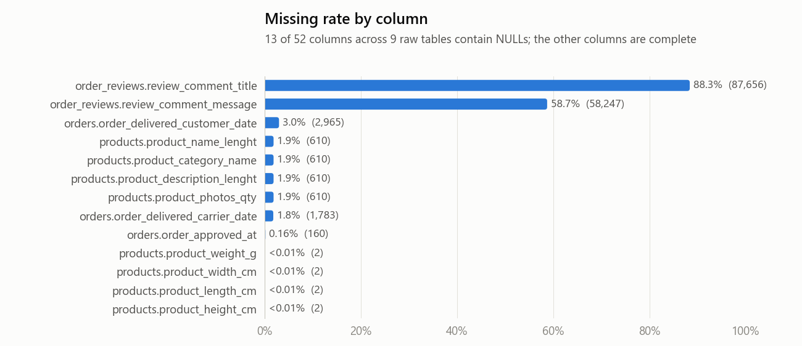

- 52 個欄位中有 13 個含 NULL，其餘 39 個完整。
- 88.3% 的評論沒有 `review_comment_title`，58.7% 沒有 `review_comment_message`；56,518 則兩者皆無。
- `products` 中同樣的 610 筆（1.9%）在 4 個描述欄位（品類、名稱長度、描述長度、照片數）同時為 NULL；另有 2 筆商品缺尺寸與重量。

### 1.2 訂單時間欄位 × 訂單狀態
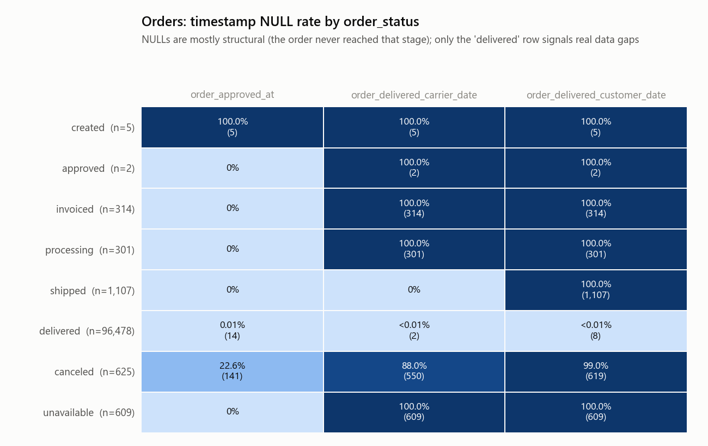

- 時間欄位的 NULL 與 `order_status` 對齊：`created` 訂單三個時間全缺；`invoiced` / `processing` / `unavailable` 兩個配送日期全缺；`shipped` 訂單全缺顧客收貨日。
- 96,478 筆 `delivered` 訂單中，14 筆缺 `order_approved_at`、2 筆缺 `order_delivered_carrier_date`、8 筆缺 `order_delivered_customer_date`。

### 1.3 資料表之間的缺口
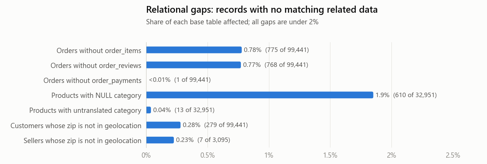

- 775 筆訂單（0.78%）沒有商品明細、768 筆（0.77%）沒有評論、1 筆沒有付款紀錄。
- 13 筆商品屬於翻譯表中沒有的 2 個品類（`pc_gamer`、`portateis_cozinha_e_preparadores_de_alimentos`）。
- 279 位顧客、7 家店家的郵遞區號在地理資料中找不到。

## 2. 顧客 (Customers)

### 2.1 地區
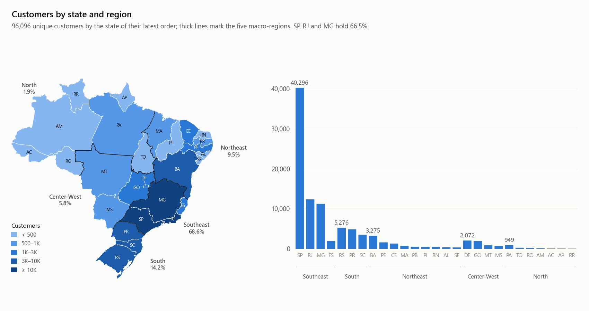

- 共 96,096 位顧客。SP、RJ、MG 三州合計 66.5%，SP 單州 41.9%。
- 依區域：東南部 68.6%、南部 14.2%、東北部 9.5%、中西部 5.8%、北部 1.9%。

### 2.2 各季消費
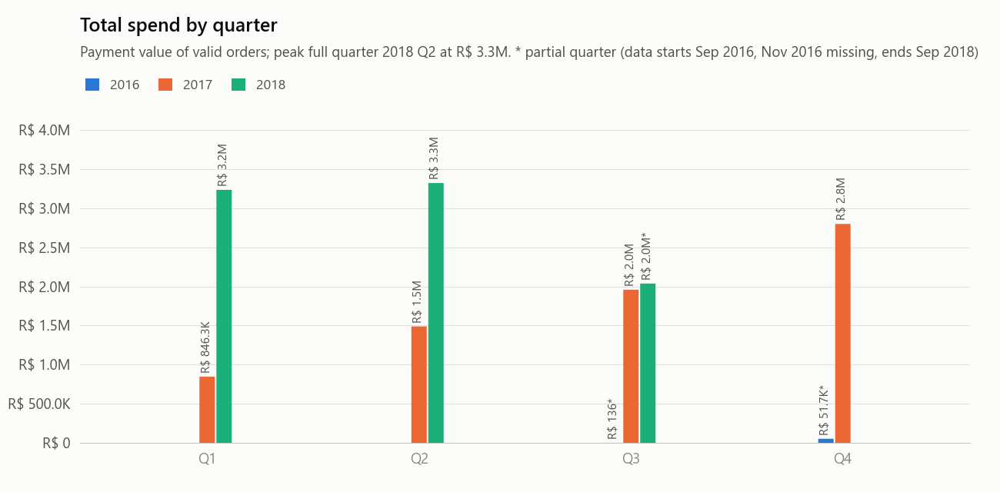
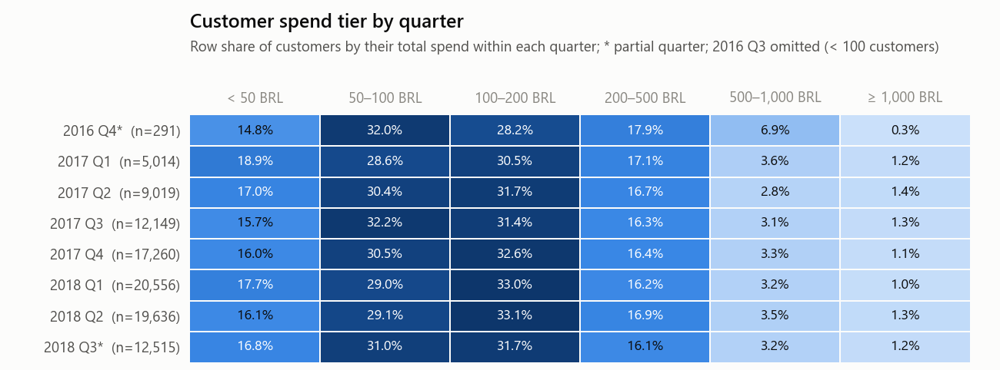

- 完整季度中，總消費額從 R$ 846K（2017 Q1）增加到 R$ 3.3M（2018 Q2，最高）。
- 每季顧客數從 5,014（2017 Q1）增加到 20,556（2018 Q1），每位顧客的季消費額維持在 R$ 157–169 之間。
- 各季的消費層級分布穩定：自 2016 Q4 起，50–100 與 100–200 BRL 一直是最大的兩個層級，合計占 59–64% 的顧客。

### 2.3 付款
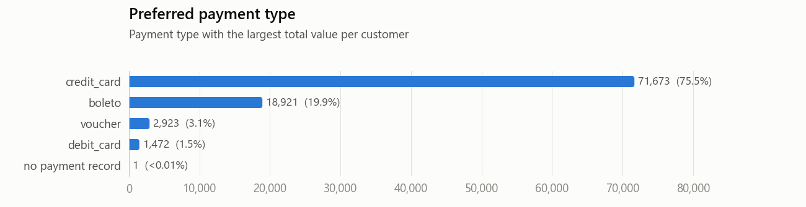
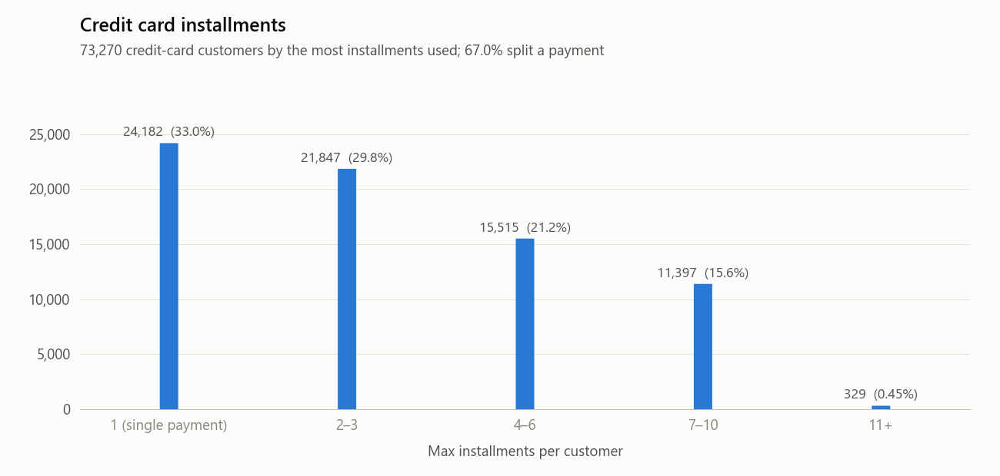

- 主要付款方式（每位顧客金額最高者）：信用卡 75.5%、boleto 19.9%、voucher 3.1%、debit card 1.5%。
- 73,270 位信用卡顧客中，33.0% 一律一次付清；67.0% 用過 2 期以上分期，15.6% 用過 7–10 期。

### 2.4 評分
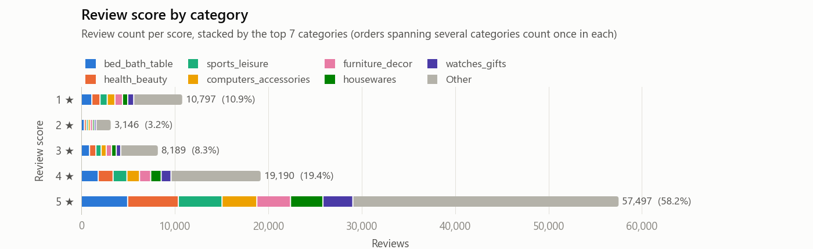

- 分布：5 ★ 58.2%、4 ★ 19.4%、3 ★ 8.3%、2 ★ 3.2%、1 ★ 10.9%。
- 呈 U 形：1 ★ 的數量多於 2 ★ 與 3 ★。

### 2.5 品類
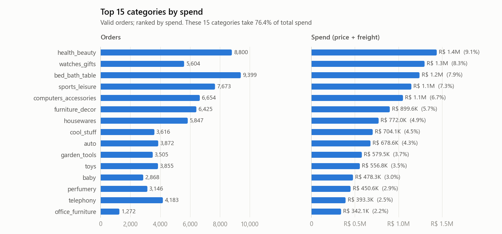

- 前 15 大品類占總消費的 76.4%。
- 訂單數排名與消費額排名不同：`bed_bath_table` 訂單數最多（9,399）但消費額排第 3；`watches_gifts` 訂單數排第 7，消費額排第 2（R$ 1.3M）。

### 2.6 各區域消費
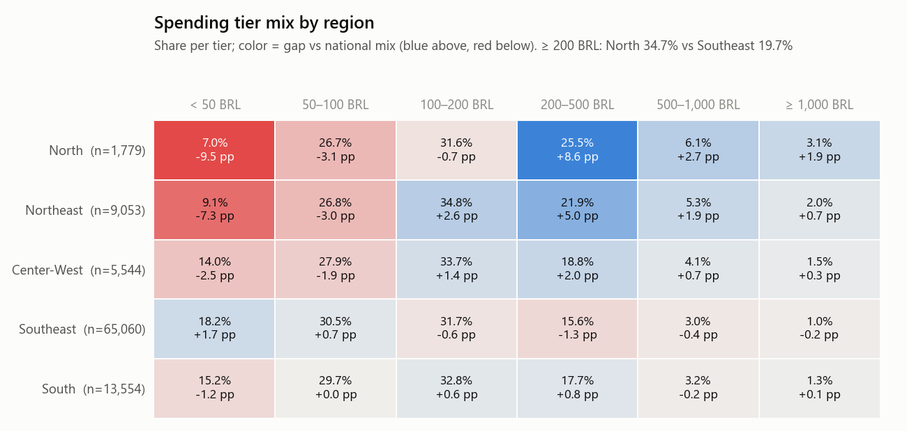
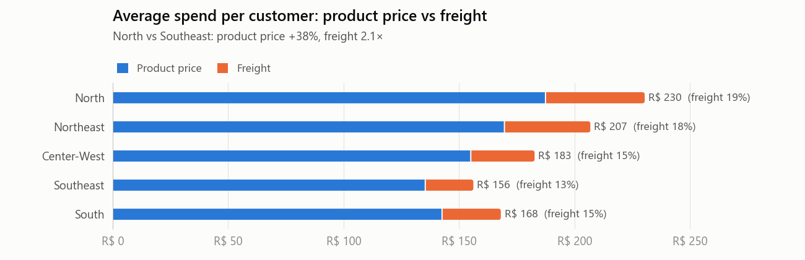

- 消費 ≥ 200 BRL 的顧客比例：北部 34.7%、東南部 19.7%。
- 每位顧客平均消費：北部 R$ 230、東北部 R$ 207、中西部 R$ 183、南部 R$ 168、東南部 R$ 156。
- 與東南部相比，北部顧客的平均商品金額高 38%，平均運費為 2.1 倍；運費占消費的比例北部 19%、東南部 13%。

## 3. 店家 (Sellers)

### 3.1 店家層級的回購率
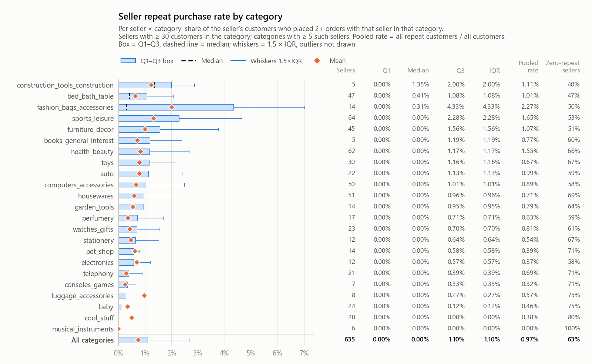

- 以顧客來看，97.0% 的購買顧客只有一筆有效訂單。
- 以店家 × 品類來看（該品類客戶 ≥ 30 位的店家，共 635 組）：63% 的店家完全沒有回頭客；整體 Q1 = 0%、中位數 = 0%、Q3 = 1.1%。
- 只有 3 個品類的中位數高於 0%：`construction_tools_construction` 1.35%、`bed_bath_table` 0.41%、`fashion_bags_accessories` 0.31%；其中 `fashion_bags_accessories` 分布最寬（Q3 4.33%）。

### 3.2 店家與顧客的位置
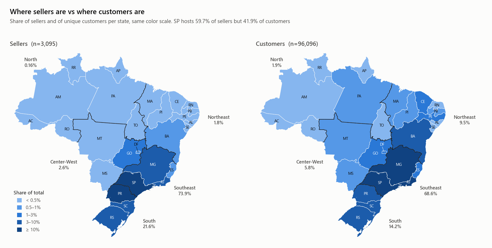
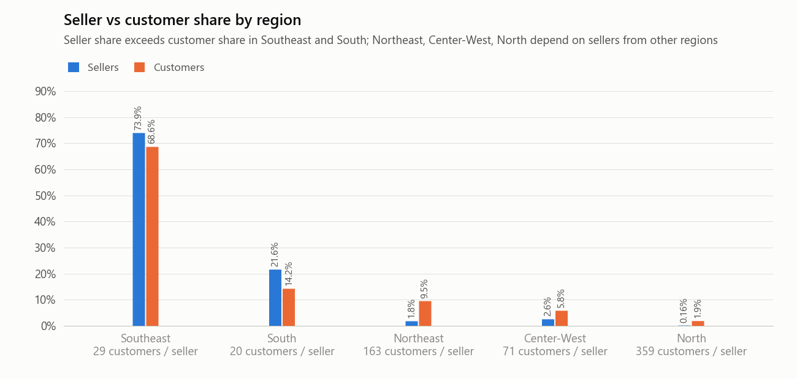

- 3,095 家店家中有 3,088 家（99.8%）可定位。
- SP 州有 59.7% 的店家、41.9% 的顧客。
- 店家占比高於顧客占比的區域：東南部（73.9% vs 68.6%）、南部（21.6% vs 14.2%）；低於顧客占比的區域：東北部（1.8% vs 9.5%）、中西部（2.6% vs 5.8%）、北部（0.16% vs 1.9%）。
- 每家店家對應的顧客數：北部 359、東北部 163、中西部 71、東南部 29、南部 20。

### 3.3 出貨流向
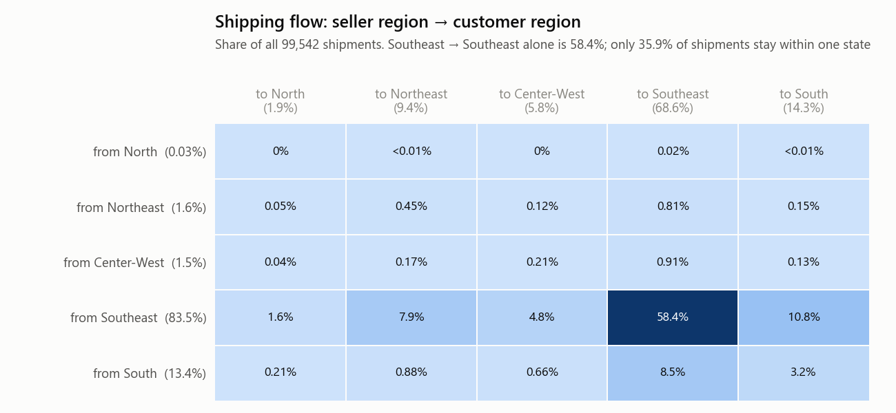
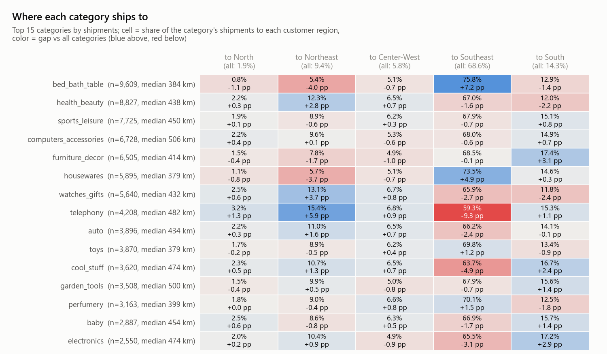

- 83.5% 的出貨從東南部寄出；東南部寄往東南部即占 58.4%。
- 35.9% 的出貨為同州寄送。
- 各品類的目的地分布不同：`telephony` 有 15.4% 寄往東北部（全品類為 9.4%）；`bed_bath_table` 有 75.8% 寄往東南部（全品類為 68.6%）。
- 前 15 大品類的寄送距離中位數介於 379 km（`housewares`、`toys`）到 506 km（`computers_accessories`）。

## 4. 訂單金額 (Order Value)

### 4.1 距離與訂單金額
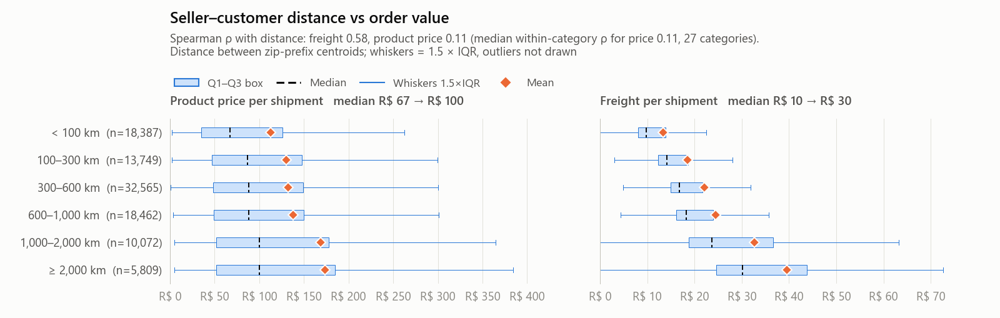

- 運費隨距離增加：中位數從 R$ 10（< 100 km）到 R$ 30（≥ 2,000 km）；Spearman ρ = 0.58。
- 每筆出貨的商品金額與距離僅弱相關（ρ = 0.11；同品類內 ρ 的中位數也是 0.11）。中位數在 100 km 以內為 R$ 67，超過 100 km 為 R$ 87–100。

### 4.2 各品類的平均 vs 中位數
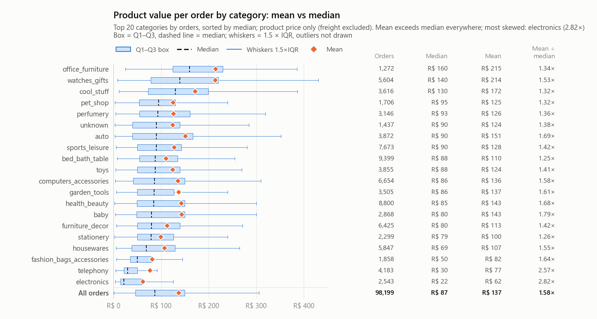

- 前 20 大品類的每筆訂單商品金額，平均值全部高於中位數（1.25–2.82 倍）；全部訂單的中位數 R$ 87、平均 R$ 137。
- 差距最大：`electronics`（中位數 R$ 22、平均 R$ 62，2.82 倍）、`telephony`（R$ 30 vs R$ 77，2.57 倍）。
- 中位數最高為 `office_furniture` R$ 160，最低為 `electronics` R$ 22。

### 4.3 各區域的單次消費額
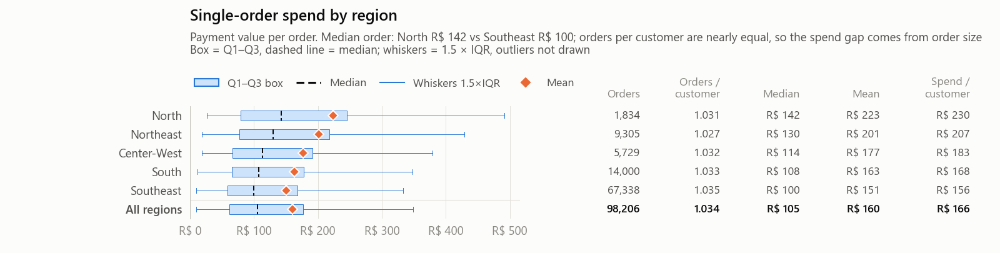

- 每筆訂單付款金額中位數：北部 R$ 142、東北部 R$ 130、中西部 R$ 114、南部 R$ 108、東南部 R$ 100。
- 各區每位顧客的訂單數相近（1.027–1.035），因此各區每位顧客消費額的排名與單筆訂單金額的排名一致。
